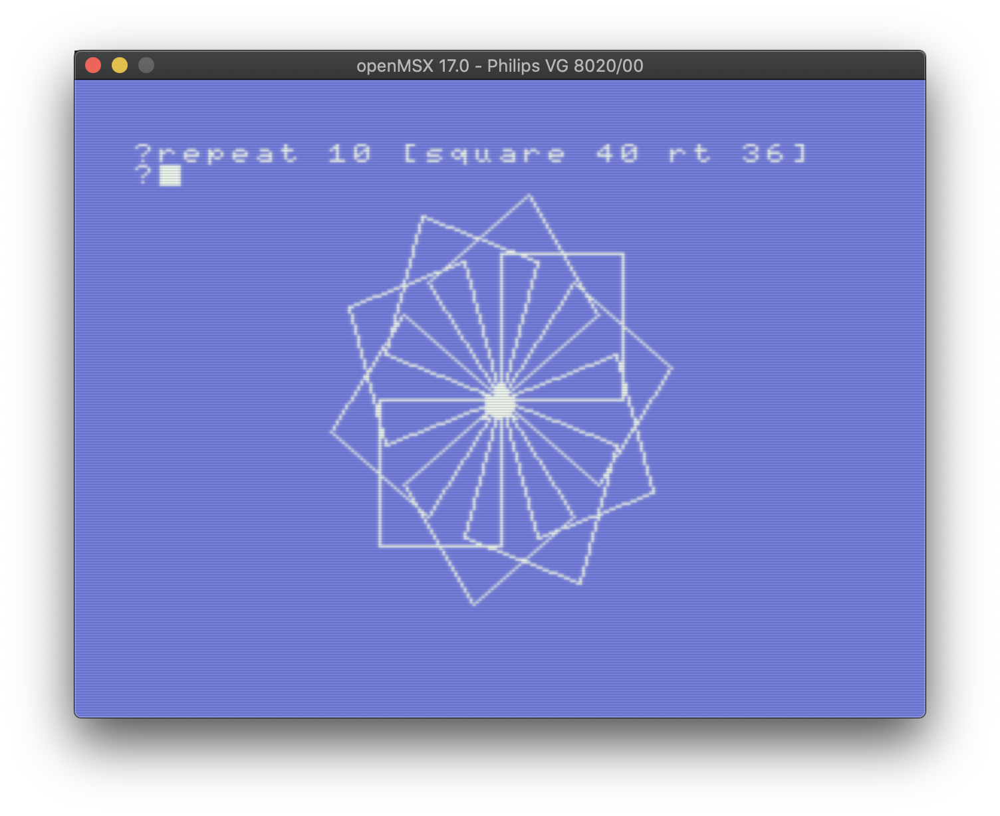

## MSX Page

Testing the pages


Launching the emulator

```
./openMSX.app/Contents/MacOS/openmsx -machine Philips_VG_8020
```

ROMS are located here :

```
ls -ltr ~/.openMSX/share/systemroms 
total 200
-rw-r--r--@ 1 davydewaele  staff    217 May 22  2021 README
-rw-r--r--@ 1 davydewaele  staff  32768 Feb 14 17:27 nms8250_basic-bios2.rom
-rw-r--r--@ 1 davydewaele  staff  16384 Feb 14 17:43 nms8250_msx2sub.rom
-rw-r--r--@ 1 davydewaele  staff  16384 Feb 14 17:43 nms8250_disk.rom
-rw-r--r--@ 1 davydewaele  staff  32768 Feb 14 21:32 vg8020_basic-bios1.rom
```


## Small LOGO app



```
TO square :length
  repeat 4 [ fd :length rt 90 ]
END

REPEAT 10 [square 30 rt 36]
```